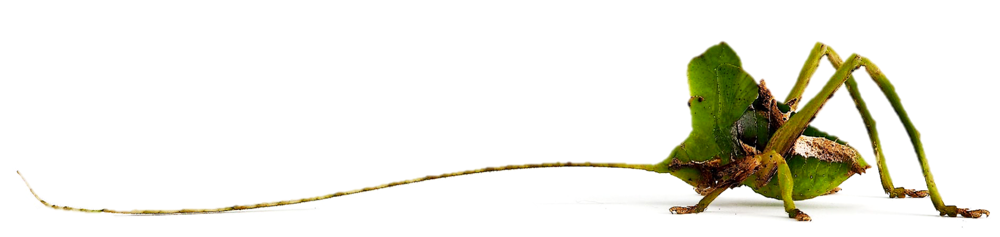

 

## About me
 

I'm a Ph.D. candidate in the [Ecology, Evolution, Ecosystems & Society graduate program](https://sites.dartmouth.edu/EEES/) at Dartmouth College. I study the signaling behavior of crickets and katydids. 

Animals use diverse strategies to communicate with each other, with crickets and katydids forming a group of insects that employ sound (and sometimes other types of signals) to attract the attention of potential mates. I study variation in the communication strategies of these insects. My work involves recording sound and vibrational calls from tropical species of both crickets and katydids; quantifying differences in call properties within an individual over time, between individuals, and between species; and testing the behavior of calling animals and their audiences under different conditions, such as when predators are present or absent.

Read more about my research [here](Research_V2.html), download [my CV](Kernan_CV_May2021.pdf), or follow the links on the right side of the menu bar to find me elsewhere. 

Contact: ciara.e.kernan.gr@dartmouth.edu

 

